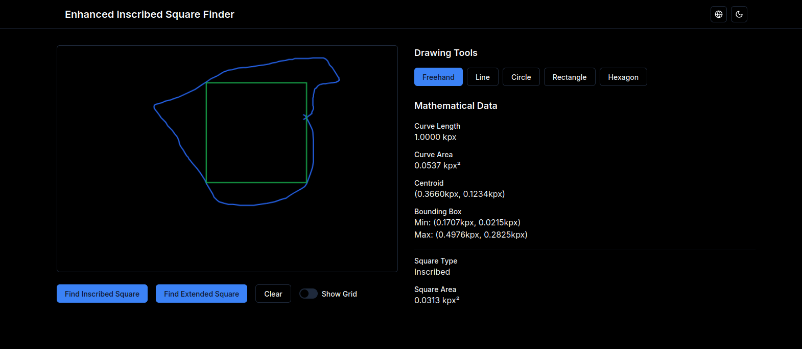

# Inscribed Square Finder



## Description

The Inscribed Square Finder is an interactive web application that allows users to explore the fascinating world of inscribed squares within closed curves. This project combines advanced mathematics with modern web technologies to provide an engaging and educational experience.

## Features

- Draw closed curves using various tools (freehand, line, circle, rectangle, polygon)
- Find inscribed squares within the drawn curves
- Find extended squares that encompass the entire curve
- Calculate and display mathematical data (curve length, area, centroid, etc.)
- Responsive design for various screen sizes
- Dark mode support
- Internationalization (i18n) support for multiple languages

## Technologies Used

- Next.js 13 with App Router
- React 18
- TypeScript
- Tailwind CSS
- shadcn/ui components
- next-intl for internationalization
- Lucide React for icons

## Prerequisites

- Node.js (v14 or later)
- npm or yarn

## Installation

1. Clone the repository:

```bash
git clone https://github.com/your-username/inscribed-square-finder.git
cd inscribed-square-finder
```

2. Install dependencies:

```bash
npm install
# or
yarn install
```

3. Create a `.env.local` file in the root directory and add any necessary environment variables:

```
NEXT_PUBLIC_API_URL=your_api_url_here
```

## Running the Application

To run the development server:

```bash
npm run dev
# or
yarn dev
```

Open [http://localhost:3000](http://localhost:3000) in your browser to see the application.


## Internationalization (i18n)

This project supports multiple languages. To add a new language:

1. Create a new JSON file in the `messages/` directory (e.g., `de.json` for German).
2. Add the new locale to the `locales` array in `config/index.ts`.
3. Update the `generateStaticParams` function in `app/[locale]/layout.tsx` to include the new locale.

## Contributing

Contributions are welcome! Please feel free to submit a Pull Request.

## License

This project is licensed under the MIT License - see the [LICENSE](LICENSE) file for details.